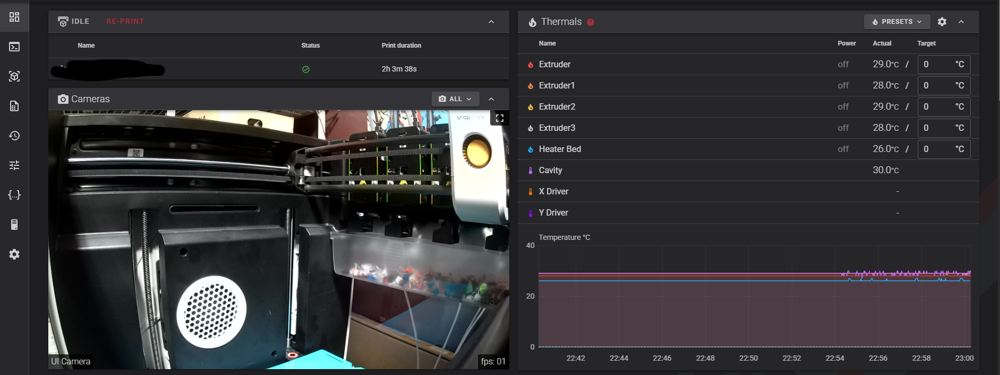

# Snapmaker U1 Stock Camera Bridge for Fluidd


**Unofficial community project — not affiliated with or endorsed by Snapmaker.**

A self-contained bridge that exposes the Snapmaker U1 built-in MIPI camera in Fluidd while retaining the stock camera service. No Raspberry Pi, external PC, Docker container, or replacement camera firmware is required.
Unofficial community project — not affiliated with or endorsed by Snapmaker.

## What it does

The U1 stock service (`unisrv`) captures the MIPI camera to `/tmp/.monitor.jpg`. This project starts the stock LAN monitor through the printer's local MQTT interface, serves that JPEG as an MJPEG/snapshot endpoint on `127.0.0.1:8080`, and uses the U1's existing nginx `/webcam/` proxy and Fluidd camera entry.

`MIPI camera -> unisrv -> /tmp/.monitor.jpg -> Python MJPEG bridge -> nginx /webcam/ -> Fluidd`

The camera has been physically verified at approximately 1 FPS and verified to return automatically after a U1 reboot.

## v1.0.1 automatic camera watchdog

v1.0.1 adds automatic recovery for the stock camera monitor. If `/tmp/.monitor.jpg` stops advancing for 15 seconds, the bridge requests `camera.start_monitor` again through the U1's existing local MQTT interface. Recovery requests are rate-limited to one every 15 seconds. The watchdog does **not** restart `unisrv`, Klipper, Moonraker, or the printer.

Hardware validation on a Snapmaker U1 completed **four automatic recoveries** during the v1.0.1 watchdog test. After each induced/observed camera-monitor stop, frame capture resumed without manually restarting the printer or `unisrv`.



## Fluidd camera settings

Edit the existing **UI Camera** entry:

- Enabled: On
- Stream type: **MJPEG Adaptive**
- FPS Target: **1**
- FPS Target when not in focus: **1**
- Camera URL Stream: `/webcam/?action=stream`
- Camera URL Snapshot: `/webcam/?action=snapshot`
- Flip horizontal/vertical: Off unless desired
- Rotation: None unless desired


## Install

Copy this release directory to the U1, SSH in as root, enter the directory, and run:

```sh
chmod +x install.sh
./install.sh
```

The installer copies the bridge to `/oem/printer_data/u1_camera/`, installs `/etc/init.d/S64u1-camera`, backs up the current `S99_bootcontrol`, and adds only the S64 startup line. It does **not** replace the printer's complete boot-control file and does not remove existing S62/S63 WLED services.

## Status

```sh
./status.sh
```

## Firmware updates and recovery

Firmware updates may replace `/etc/init.d/S64u1-camera` or remove the S64 boot hook. A recovery copy is stored under `/oem/printer_data/u1_camera/recovery/`.

After an update, use:

```sh
cd /oem/printer_data/u1_camera/recovery
./repair.sh
```

### Compatibility safety

`repair.sh` follows **detect -> validate -> back up -> repair**. It first verifies the stock `unisrv`, local MQTT tooling, Fluidd/nginx webcam plumbing, and expected `S99_bootcontrol` structure. If those dependencies no longer match, it stops rather than blindly applying an old configuration.

**Never restore an old `S99_bootcontrol` over a newer Snapmaker firmware.** The repair script patches the current firmware's boot file only after compatibility checks pass.

## Uninstall

```sh
./uninstall.sh
```

This stops/removes S64 and removes only its boot-hook line. Recovery files are intentionally preserved.

## Notes

- Designed for the stock Snapmaker U1 software stack observed during development.
- Uses Python standard library only for the MJPEG bridge.
- Uses the printer's existing Mosquitto/unisrv camera RPC interface.
- No private/local IP address is hard-coded in this project.
- Future Snapmaker firmware can change undocumented internal interfaces; use the compatibility checks rather than forcing a repair.

## Release

Current release: **v1.0.1**.

- v1.0.1: Adds stale-frame watchdog and rate-limited automatic `camera.start_monitor` recovery. Hardware-tested with four automatic recoveries.
- v1.0.0: Initial stock-camera Fluidd bridge release.


## 🖨️ Support the Project

If this project helped you and you'd like to support continued U1 development, testing, and future projects:

<a href="https://buymeacoffee.com/hacknsniff">
  
</a>

## Disclaimer

This is an **unofficial community project** and is not affiliated with, endorsed by, or supported by Snapmaker.

This project modifies startup configuration on the Snapmaker U1 and is provided **as-is**. Use it at your own risk. Modifications to your printer may affect support or warranty coverage.

This project does **not** distribute Snapmaker proprietary firmware files. It uses services and interfaces already present in the stock U1 firmware.
