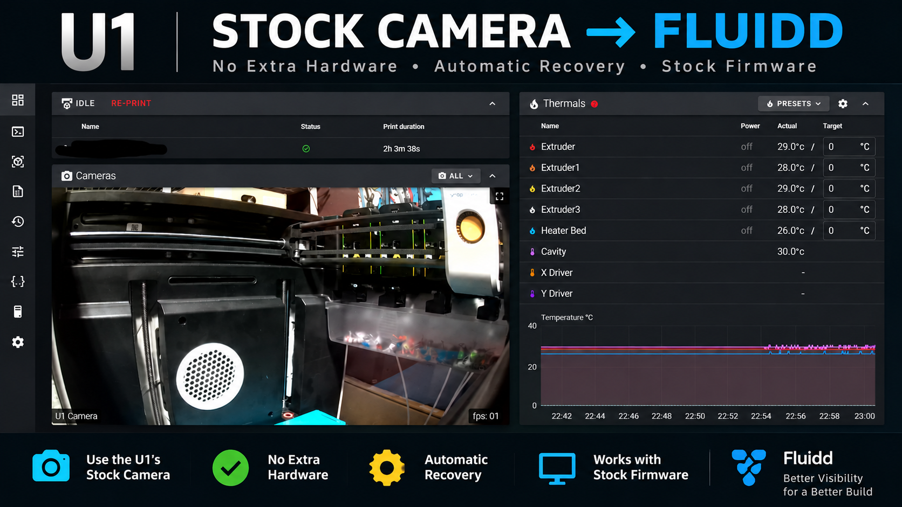
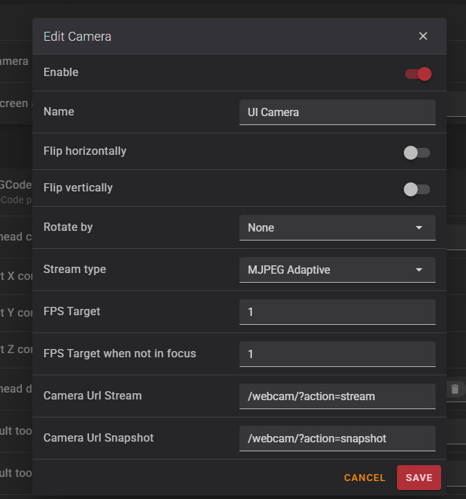

# Snapmaker U1 Stock Camera Bridge for Fluidd



**Unofficial community project — not affiliated with or endorsed by Snapmaker.**

A self-contained bridge that exposes the Snapmaker U1 built-in MIPI camera in Fluidd while retaining the stock camera service. No Raspberry Pi, external PC, Docker container, or replacement camera firmware is required.


## What it does

The U1 stock service (`unisrv`) captures the MIPI camera to `/tmp/.monitor.jpg`. This project starts the stock LAN monitor through the printer's local MQTT interface, serves that JPEG as an MJPEG/snapshot endpoint on `127.0.0.1:8080`, and uses the U1's existing nginx `/webcam/` proxy and Fluidd camera entry.

`MIPI camera -> unisrv -> /tmp/.monitor.jpg -> Python MJPEG bridge -> nginx /webcam/ -> Fluidd`

The camera has been physically verified at approximately 1 FPS and verified to return automatically after a U1 reboot.


## v1.0.3 demand-based camera wake

v1.0.3 changes normal stale-camera recovery from periodic background restarts to **wake on demand**.

When Fluidd requests a snapshot or opens a stream, the bridge checks the shared `/tmp/.monitor.jpg` frame. If the frame is fresh, it serves it normally. If the frame is stale, the bridge requests **one** stock LAN camera monitor start, waits briefly for a new frame, and applies a cooldown so repeated Fluidd refreshes do not hammer the local MQTT camera interface.

If nobody is viewing the Fluidd camera, normal stale-frame recovery does not repeatedly restart the LAN monitor. The existing bounded WAN-session recovery fallback from v1.0.2 remains in place for failed stock-camera sessions.

### Hardware validation

The v1.0.3 bridge was tested on a physical Snapmaker U1. During a long-idle test, the shared camera source remained stale for approximately two hours. Opening/using Fluidd generated exactly **one** demand-based LAN wake and a fresh frame arrived immediately afterward. No repeating 90-second LAN restart loop occurred.

Coexistence testing then confirmed:

- Fluidd remained live after demand-based recovery.
- Snapmaker Orca reconnected after its normal long-idle device/cloud timeout and kept its camera hibernated until Play was selected.
- Snapmaker Orca camera playback started normally while Fluidd remained live.
- The Snapmaker mobile app camera also worked.
- Fluidd, Snapmaker Orca, and the Snapmaker mobile app were verified working concurrently.
- After a normal U1 reboot, the bridge started through the normal service path and Fluidd camera access returned without an additional demand wake.

This is a coexistence improvement, not a replacement for Snapmaker's camera system. The bridge does not modify Snapmaker camera encryption or cloud services and does not restart `unisrv`, Klipper, Moonraker, or the printer.

Snapmaker Orca and mobile app coexistence

Snapmaker U1 camera sessions used by Fluidd, Snapmaker Orca, and the Snapmaker mobile app have different lifecycle behavior.

Starting with v1.0.3, Fluidd no longer periodically wakes the stock camera while it is idle. If Fluidd requests the camera and the shared image source is stale, the bridge requests a single LAN camera wake.

Hardware testing confirmed that Fluidd, Snapmaker Orca, and the Snapmaker mobile app can coexist with this behavior.

Normal Snapmaker camera hibernation is expected. If Snapmaker Orca reports that the Monitoring Module is hibernated, use Play in Snapmaker Orca to wake its camera session normally.

## Fluidd camera settings

Edit the existing **UI Camera** entry:

- Enabled: On
- Stream type: **MJPEG Adaptive**
- FPS Target: **1**
- FPS Target when not in focus: **1**
- Camera URL Stream: `/webcam/?action=stream`
- Camera URL Snapshot: `/webcam/?action=snapshot`
- Flip horizontal/vertical: Off unless desired
- Rotation: None unless desired




## Install

Copy this release directory to the U1, SSH in as root, enter the directory, and run:

```sh
chmod +x install.sh
./install.sh
```

The installer copies the bridge and camera recovery policy to `/oem/printer_data/u1_camera/`, installs `/etc/init.d/S64u1-camera`, backs up the current `S99_bootcontrol`, and adds only the S64 startup line. It does **not** replace the printer's complete boot-control file and does not remove existing S62/S63 WLED services.


## Status

```sh
./status.sh
```


## Firmware updates and recovery

Firmware updates may replace `/etc/init.d/S64u1-camera` or remove the S64 boot hook. A recovery copy is stored under `/oem/printer_data/u1_camera/recovery/`.

After an update, use:

```sh
cd /oem/printer_data/u1_camera/recovery
./repair.sh
```

### Compatibility safety

`repair.sh` follows **detect -> validate -> back up -> repair**. It first verifies the stock `unisrv`, local MQTT tooling, Fluidd/nginx webcam plumbing, and expected `S99_bootcontrol` structure. If those dependencies no longer match, it stops rather than blindly applying an old configuration.

**Never restore an old `S99_bootcontrol` over a newer Snapmaker firmware.** The repair script patches the current firmware's boot file only after compatibility checks pass.


## Uninstall

```sh
./uninstall.sh
```

This stops/removes S64 and removes only its boot-hook line. Recovery files are intentionally preserved.


## Notes

- Designed for the stock Snapmaker U1 software stack observed during development.
- Uses Python standard library only for the MJPEG bridge.
- Uses the printer's existing Mosquitto/unisrv camera RPC interface.
- No private/local IP address is hard-coded in this project.
- `u1_camera_policy.py` contains the camera recovery policy used by the bridge.
- No nginx configuration changes are required for v1.0.3.
- The bridge does not restart `unisrv`, Klipper, Moonraker, or the printer.
- Future Snapmaker firmware can change undocumented internal interfaces; use the compatibility checks rather than forcing a repair.


## Release

Current release: **v1.0.3**.

- **v1.0.3:** Adds hardware-validated demand-based Fluidd camera wake, replacing normal periodic stale-frame restarts while preserving WAN-session-aware recovery.
- **v1.0.2:** Improved coexistence with the stock Snapmaker camera, added WAN-session-aware recovery, a 90-second stale-frame reset window, duplicate WAN-start protection, and a 10-minute recovery fallback.
- **v1.0.1:** Added stale-frame watchdog and rate-limited automatic `camera.start_monitor` recovery. Hardware-tested with four automatic recoveries.
- **v1.0.0:** Initial stock-camera Fluidd bridge release.


## 🖨️ Support the Project

<a href="https://buymeacoffee.com/hacknsniff">
  
</a>

## License

This project's original source code is licensed under the
**GNU Affero General Public License v3.0 (AGPL-3.0)**.

Earlier versions of this project were made available under their
previous licensing terms. Rights already granted under those earlier
terms are unaffected by this change.

Fluidd, Snapmaker software, and other third-party components remain
subject to their respective licenses. This project does not relicense
or distribute those components.

## Disclaimer

This is an **unofficial community project** and is not affiliated with, endorsed by, or supported by Snapmaker.

This project modifies startup configuration on the Snapmaker U1 and is provided **as-is**. Use it at your own risk. Modifications to your printer may affect support or warranty coverage.

This project does **not** distribute Snapmaker proprietary firmware files. It uses services and interfaces already present in the stock U1 firmware.
